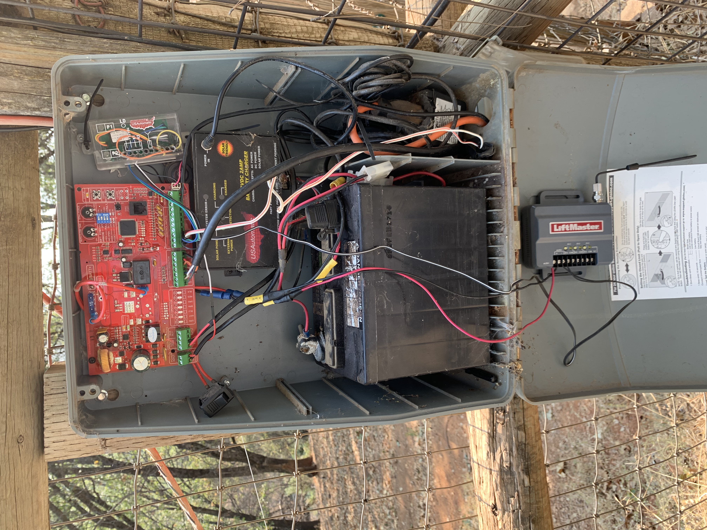

# gate-opener
Purpose: documenting my frankenstein driveway gate opener project with homekit, security+ RF, and solar battery backup. 

## History
Many years ago I bought a [US Automatic Sentry 300](https://docs.usautomatic.com/retail/manuals/openers/sentry_gate_opener_manual_english.pdf) gate opener that served me well for over 10 years with minimal effort, but recently parts were harder to come by and I needed to replace both the operating arm and control board because of compoment failures.

This meant that I had a large weatherproof box, a solar panel, and solar battery charger that were useful.

## Control Board and Arm
Locally I was able to buy a [GTO Mighty Mule 660](https://www.mightymule.com/wp-content/uploads/MM600-Manual-07-06-2010.pdf)

the control board is smaller, and when I removed it from the box I mounted it to one of the standoff posts and braced it on the solar charge controller.

I had to modify the existing wiring harness to easily attach the board to the existing battery. This made things pretty ugly since I used a bunch of crimp splices. but it gave me a fuse to prevent future issues with power draw frying the board the way it did on the old controller.

This setup charges the battery with the 18v DC from the GTO board and with the solar panel.

I initially wired up with US Automatic LCR reciever to this board so I could use GTO and US Automatic controllers. 

## Adding HomeKit Control
Since I wanted to experiment with having a homekit controlled gate, I added a Sonoff SV that has been modified to be a NO momentary switch and flashed with a homekit firmware. I soldered a small dupont wire pigtail for 12v power to the GTO board. This is wired to the COM and CYCLE inputs. I removed the LCR reciever when I added this one. More can be found in this gist: [Turning a Sonoff SV into a Home Kit Accessory to Operate a GTO Mighty Mule gate opener](https://gist.github.com/logich/4f3eeb53146414549744a3ba44705c08)

## Adding Security+ Control
After 4 years the GTO reciever began to fail and would only open at very short range. It was about as expensive to replace this with the same model as to buy a better quality liftmaster controller. I purchased a [850LM](https://smile.amazon.com/gp/product/B0071EYS9M/ref=ppx_yo_dt_b_search_asin_title?ie=UTF8&psc=1) that can be powered off 12v. 

This was wired direct to the wiring harness after the fuse for 12v power and the first switch control was wired to COM and CYCLE inputs.

The recieve distance on this controller is far longer than the GTO module and the frequencies it uses are better handled by the homelink controllers in my vehicles.

This was especially evident with my GMC truck and Tesla. The range is about the same on the version in my Honda.

## Manual Switch
I put in a small monetary switch on the bottom of the waterproof box as a backup access mode in case my transmitters were not functional. This is also wired to COM and CYCLE inputs.

## Current State
Here is an image as of September 2020 with all the messy wires:

## Future Plans
* replace remote switch with push button for visitors (like a doorbell)
* add [12v security light](https://smile.amazon.com/gp/product/B07MV2YL9J/ref=ppx_yo_dt_b_asin_title_o00_s00?ie=UTF8&psc=1)
* replace poorly wired 110v power line with low volatge direct bury line from house
* attach open and close limit sensors (waterproof reed switch) to sonoff for better homekit measurement
* put eufy camera inside enclosure
* measure the overall current draw and backup battery life
* replace lucite LCR box with project box for sonoff
* setup terminal block bus for COM and CYCLE 
